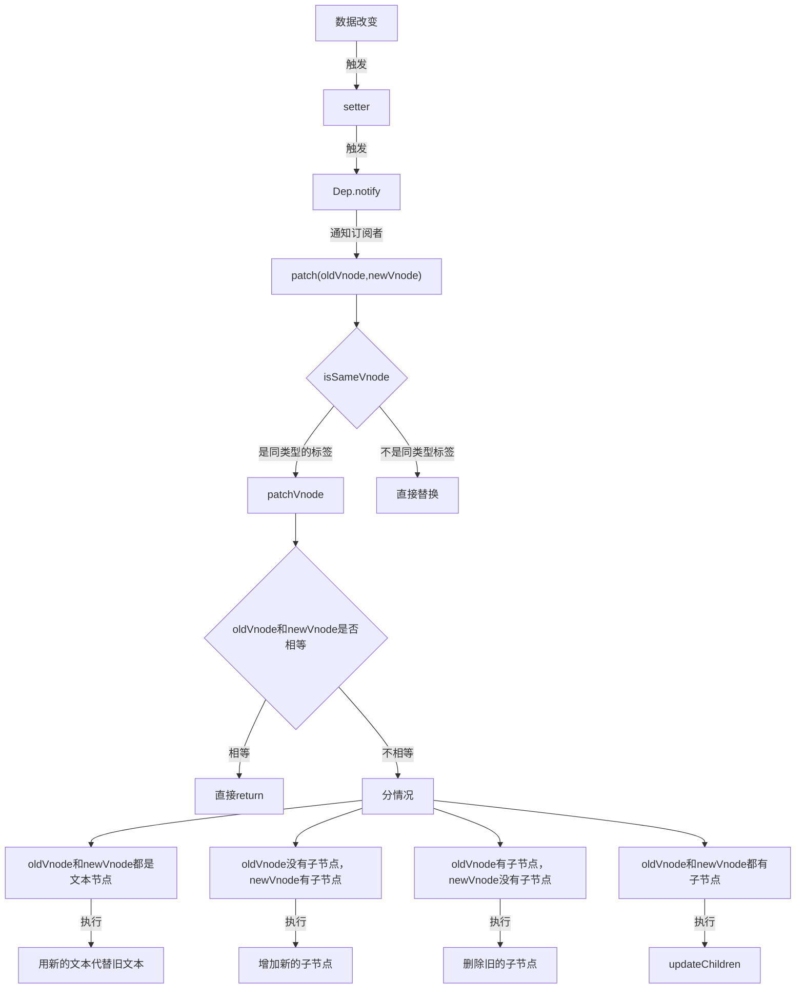

# vue2 diff算法.md

## 什么是diff算法
 本质是比较两个JS对象（虚拟dom）的差异

①依次比较，当比较成功后退出当前比较
②渲染结果以newVnode为准
③每次比较成功后start点和end点向中间靠拢
④)当新旧节点中有一个start点跑到end点右侧时终止比较
⑤如果都匹配不到，则旧虚拟DOM key值去比对新虚拟DOM的key值，如果key相同则复用，并移动到新虚拟DOM的位置